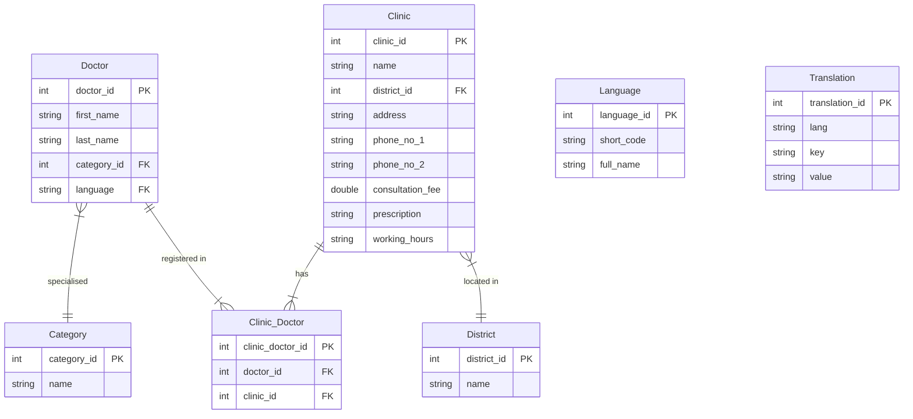

# NECKTIE Backend Assessment

## Abstract

This project aims to demonstrate the capabilities of buidling sample API using Python.

start by:

Mac/Linux

```bash
python3 manage.py runserver
```

Windows

```bash
py -3 -m manage.py runserver
```

## Stack Specficaitions

- Python >3.9.13
- Django >4.2.19
- SQLite (built-in)

## Admin panel

If you are using the db.sqlite3 from the repo, the login name is "admin", password is "password".
Otherwise, you can create a new superuser by:

Mac/Linux

```bash
python3 manage.py createsuperuser
```

Windows

```bash
py -3 -m manage.py createsuperuser
```

## 1. Choice of Framework & Library

There are multiple popular choices including Flask, Django, and FastAPI. The reason Django was selected is mainly because it is in the tech spec in the job description, which means the company is using Django. I have used Flask before to provide a UI and endpoints to call my AI model for hate speech detection, it was great with even simpler setup which is excellent for single page system, however it is not suitable for a complex solution and scaling up, and it is comparatively slow. FastAPI is very fast for building API, and it is great for microservices. It is highly scalable and simple, yet it does not support ORM.

a. Django in this case is a more suitable choice for complex development. It is scalable, having its database tools which is very convenient, its builtin admin panel is also a great helper. It is faster than Flask. The draw back of Django is the learning curve is steep, the documentation is large and complicated which would require some time to be familiar with the libraries and built-in methods. Security was also another consideration as it has built-in protection already like CSRF and SQL injection, which it is not available with Flask.

b. A few assumptions were made:

- Assuming this were to build a whole system in real situation, therefore Django was picked. Otherwise, Flask and FastAPI is good enough and faster on development for a small demonstration purpose.

- It is a large scale platform which needs reliability and security is a concern.

## 2. Potential Improvement

Better error handling and edge case testing can be made. Pagination is definitely a must have since there will be a lot of doctors. Logging should also be implemented.

I have brainstormed about the bonus points as well, the Translation model have been made but since the time was over 8 hours including reading the documentation, I wish I could have enough time to finish them.

## 3. Production consideration

For production, there will be more concerns on server side and CI/CD. Depends on the actual environment, CI/CD pipelines can be created, docker can be used for better maintenance. Redis can be considered for caching. Rate limit should be applied to the system (using lib like django-ratelimit, although cannot compare with Amazon API gateway). Prod/Stage/Dev environment and variables should be carefully maintained, as well
as Gitflow should be applied.

## 4. Assumptions

a. I have assumed that Doctors can work in multiple clinic, and clinic can have multiple doctors which is a many to many relationship, therefore a bridging table was used. I have assumed suitable size for the variables to use the right amount of bytes. I also assumed there referencing relationship and created different models. I assumed while the foreign key related table should not be deleted as CASCADE. Created_at and Updated_at should be exist for specific models. JSON was assumed to be the API output.

b. Single endpoint processing both GET and POST was assumed, for best practice. JSON return "success" message, and "data" includes the respective data.

## Model ERD


